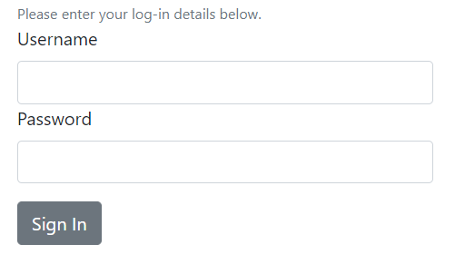
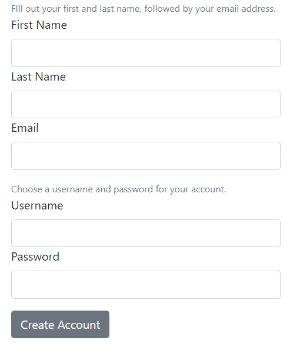

# Welcome to better-form-factory: for React Applications
Create a form for your webpage in minutes using FormFactory! The diverse set of controls can help you customize even the most complicated forms with minimal typing. The result is a super-legible, coherent code that can be shipped to any application you want.
## List of Controls
You can import any of the following controls using the syntax:
```javascript
import {ControlName} from 'better-form-factory';
```
Here is what you have to choose from:
* Page 
* Section
* FirstName
* MiddleName
* LastName
* Email
* Username
* Password
* Text
* Button
* Checkbox

Currently there are also the following experimental features
* Radio button

## General Use
After declaring a component it will have a default display header depending on the component being used.
To change this you can change the `label` attribute. All other attributes will be applied normally to the 
component, including function handles.
```javascript
<Control label={controlLabel} onChange={() => { ... }} />
// or more simply
<Control />
```


## Sign In Page
```javascript
import React, {PureComponent} from 'react';
import {Button} from 'reactstrap';
import {
	Page,
	Section, 
	Paragraph as Text,
	Email, 
	Username, 
	Password
} from 'better-form-factory';

export class SignInDemo extends PureComponent {
  render() {
    return (
		<Page size={5}>
			<Text>Please enter your log-in details below.</Text>
			<Section>
				<Username />
				<Password />
			</Section>
			<Section>
				<Button>Sign In</Button>
			</Section>
		</Page>   
    );
  }
}
```


## Create Account Page
```javascript
import React, {PureComponent} from 'react';
import {Button} from 'reactstrap';
import {
	Page, 
	Section,
	FirstName,
	LastName,
	Email, 
	Username, 
	Password,
	Paragraph as Text
} from 'better-form-factory';

export class CreateAccountDemo extends PureComponent {
  render() {
    return (
		<Page size={5}>
			<Section>
				<Text>Fill out your first and last name, followed by your email address.</Text>
				<FirstName />
				<LastName />
				<Email />
			</Section>
			<Section>
				<Text>Choose a username and password for your account.</Text>
				<Username />
				<Password />
			</Section>
			<Section>
				<Button>Create Account</Button>
			</Section>
		</Page>   
    );
  }
}
```

```javascript
Page.propTypes = {
	size: PropTypes.number
};

Page.defaultProps = {
	size: 3
};

FirstName.propTypes = {
	label: PropTypes.string
};

FirstName.defaultProps = {
	label: 'First Name'
};

MiddleName.propTypes = {
	label: PropTypes.string
};

MiddleName.defaultProps = {
	label: 'Middle Name'
};

LastName.propTypes = {
	label: PropTypes.string
};

LastName.defaultProps = {
	label: 'Last Name'
};

Email.propTypes = {
	label: PropTypes.string,
};

Email.defaultProps = {
	label: 'Email'
};

Username.propTypes = {
	label: PropTypes.string,
};

Username.defaultProps = {
	label: 'Username'
};

Password.propTypes = {
	label: PropTypes.string,
};

Password.defaultProps = {
	label: 'Password'
};

Textarea.propTypes = {
	label: PropTypes.string,
};

Textarea.defaultProps = {
	label: 'Text Area'
};

File.propTypes = {
	label: PropTypes.string,
};

File.defaultProps = {
	label: 'File'
};
```